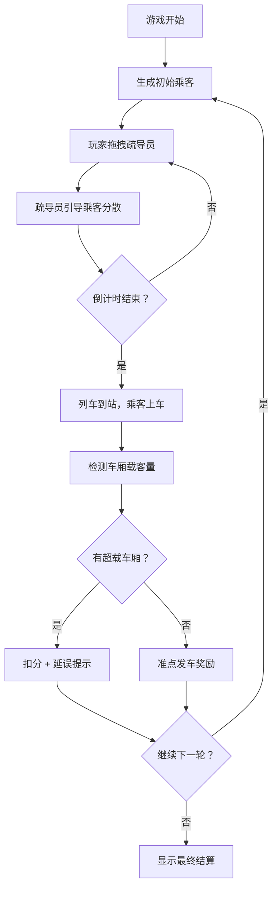

## 1. 产品概述
地铁站台乘客疏导模拟游戏，玩家作为站台调度员在早高峰时段通过合理安排疏导员位置，引导乘客均匀分布到各节车厢门口，避免车厢超载导致发车延误和扣分。
- 核心玩法：拖拽有限数量的疏导员到候车区，平衡各区域乘客密度
- 目标用户：休闲游戏玩家、模拟经营爱好者

## 2. 核心 Features

### 2.1 Feature Module
1. **游戏主界面**：站台俯视图、车厢候车区、乘客显示、疏导员面板、计分系统
2. **倒计时系统**：列车进站倒计时、上下车时间窗口
3. **拖拽交互**：疏导员拖拽放置、移除回收
4. **结算系统**：车厢超载检测、延误扣分、最终得分

### 2.3 Page Details
| Page Name | Module Name | Feature description |
|-----------|-------------|---------------------|
| 游戏主页面 | 站台地图 | 俯视视角展示站台和6节车厢候车区，颜色深浅表示乘客密度 |
| 游戏主页面 | 乘客系统 | 随机生成乘客并聚集在不同候车区，显示各区域人数 |
| 游戏主页面 | 疏导员面板 | 显示可用疏导员数量，支持拖拽到候车区减少乘客聚集 |
| 游戏主页面 | 倒计时模块 | 列车进站倒计时、上下车阶段计时 |
| 游戏主页面 | 计分板 | 实时显示分数、延误次数、当前关卡 |
| 结算弹窗 | 结果展示 | 显示各车厢载客量、是否超载、最终得分和评级 |

## 3. Core Process
游戏开始 → 乘客随机聚集到各候车区 → 玩家拖拽疏导员到拥堵区域 → 疏导员引导乘客重新分布 → 列车倒计时结束 → 乘客上车 → 检测各车厢载客量 → 超载扣分并显示延误 → 多轮循环或游戏结束 → 显示最终结算

## 4. User Interface Design
### 4.1 Design Style
- 主色调：地铁蓝色系（#1e40af 深蓝 + #3b82f6 亮蓝），警示橙（#f97316）用于超载提示
- 按钮风格：圆角胶囊按钮，带轻微阴影和悬停上浮动效
- 字体：使用 Space Grotesk 展示字体 + Noto Sans SC 中文字体
- 布局：深色工业风背景，顶部信息栏 + 中央站台游戏区 + 底部疏导员工具栏
- 图标：使用 Lucide 图标，乘客用小人 emoji，疏导员用徽章图标

### 4.2 Page Design Overview
| Page Name | Module Name | UI Elements |
|-----------|-------------|-------------|
| 游戏主页面 | 顶部信息栏 | 分数、倒计时、关卡，水平排列，半透明深色背景 |
| 游戏主页面 | 站台游戏区 | 6个车厢候车区横向排列，每个区域显示乘客数量和密度色条 |
| 游戏主页面 | 疏导员面板 | 底部固定工具栏，疏导员图标可拖拽，显示剩余数量 |
| 游戏主页面 | 列车动画 | 列车到站/离站的横向滑入滑出动画 |
| 结算弹窗 | 结果卡片 | 各车厢载客量条形图、得分明细、重新开始按钮 |

### 4.3 Responsiveness
- 桌面端优先，最小支持 1024px 宽度
- 候车区采用响应式网格，在较小屏幕自动换行
- 触控设备支持触摸拖拽
