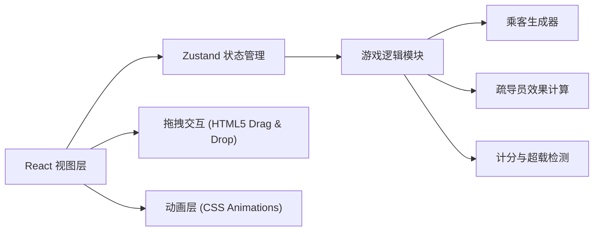
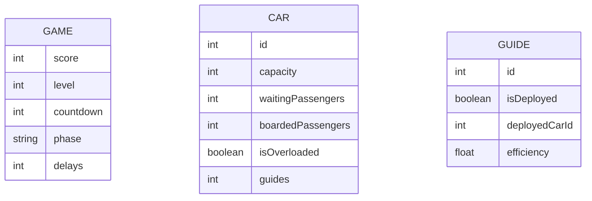

## 1. Architecture Design


## 2. Technology Description
- 前端：React@18 + TypeScript + Tailwind CSS@3 + Vite
- 初始化工具：vite-init
- 状态管理：zustand
- 图标库：lucide-react
- 后端：无（纯前端游戏）
- 数据库：无（使用本地状态）

## 3. Route Definitions
| Route | Purpose |
|-------|---------|
| / | 游戏主页面，包含所有游戏功能 |

## 6. Data Model

### 6.1 Data Model Definition


### 6.2 Type Definitions
```typescript
interface GameState {
  score: number;
  level: number;
  countdown: number;
  phase: 'waiting' | 'boarding' | 'result' | 'gameover';
  delays: number;
  cars: Car[];
  guides: Guide[];
  round: number;
}

interface Car {
  id: number;
  capacity: number;
  waitingPassengers: number;
  boardedPassengers: number;
  guides: number;
}

interface Guide {
  id: number;
  isDeployed: boolean;
  deployedCarId: number | null;
}
```
